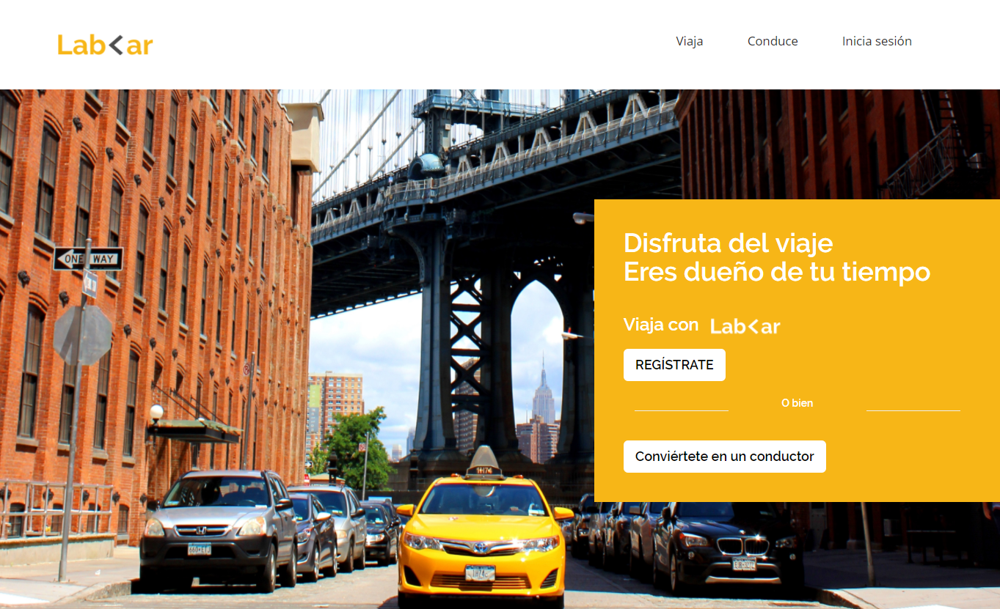

# ***EJERCICIO LAB CAR***

# *Objetivo:*

> ### *En este reto, vamos a realizar una pagina web responsive con bootstrap. La estructura de la página y el diseño es la siguiente:*

## *MOVIL:*

## *DESKTOP:*

--------------------------------

## ***Trabajo realizado por Wendy Tamara***

* Se realizo la pagina web adaptable (responsive) tanto para desktop como para dispositivos moviles, utilizando bootstrap.

## *Proyecto desplegado en:*

* [gh-pages](https://wendytamara.github.io/lab-car-boilerplate/ "Título del enlace")
